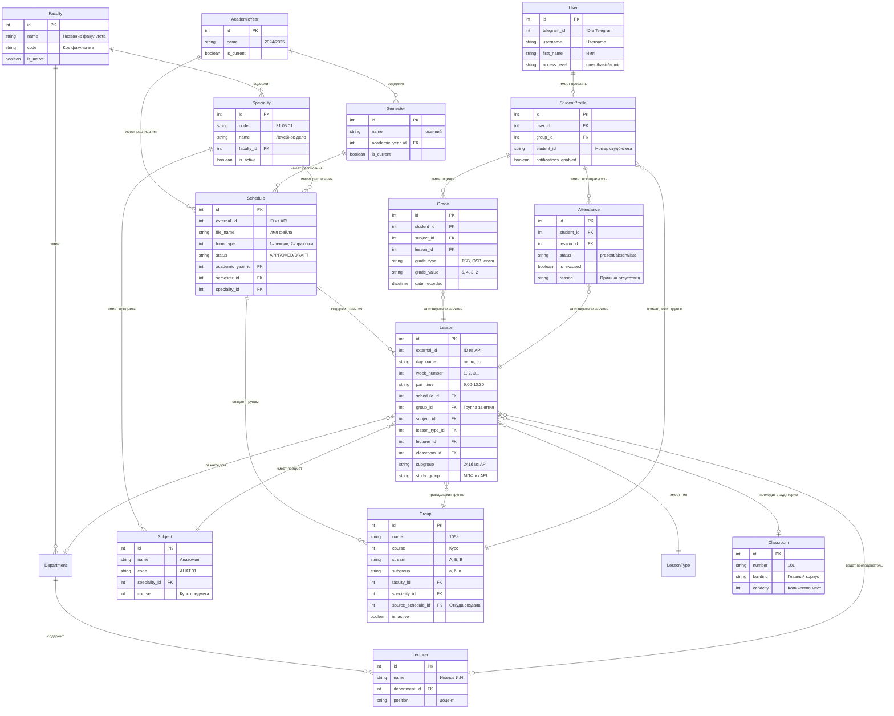

# Исправленная структура БД SZGMU Bot

## Основные изменения:

1. **Группы создаются из расписаний** - добавлена связь `groups.source_schedule_id`
2. **Убраны legacy поля** - только нормализованные связи
3. **Правильная иерархия** - Schedule → Lessons → Groups
4. **Добавлены индексы** для производительности

## Диаграмма структуры:



## Процесс создания групп:

### 1. Синхронизация с API
```
API СЗГМУ → Schedule (расписания) → Lessons (занятия)
```

### 2. Извлечение групп из занятий
```python
# Псевдокод
for lesson in lessons:
    group_name = lesson.study_group  # "105а"
    subgroup = lesson.subgroup       # "241б"
    
    # Создать группу если не существует
    group = find_or_create_group(
        name=group_name,
        course=extract_course(group_name),
        stream=extract_stream(group_name),
        subgroup=subgroup,
        faculty_id=lesson.schedule.speciality.faculty_id,
        speciality_id=lesson.schedule.speciality_id,
        source_schedule_id=lesson.schedule_id
    )
    
    # Привязать занятие к группе
    lesson.group_id = group.id
```

### 3. Связывание пользователей
```python
# Пользователь выбирает группу
user_profile.group_id = selected_group.id
```

## Ключевые улучшения:

1. **Группы создаются автоматически** из расписаний
2. **Нет дублирования данных** - только нормализованные связи
3. **Правильная иерархия** - Schedule → Lessons → Groups
4. **Отслеживание источника** - `source_schedule_id` показывает откуда создана группа
5. **Гибкость** - один Schedule может создавать несколько групп
6. **Производительность** - добавлены индексы для быстрого поиска
