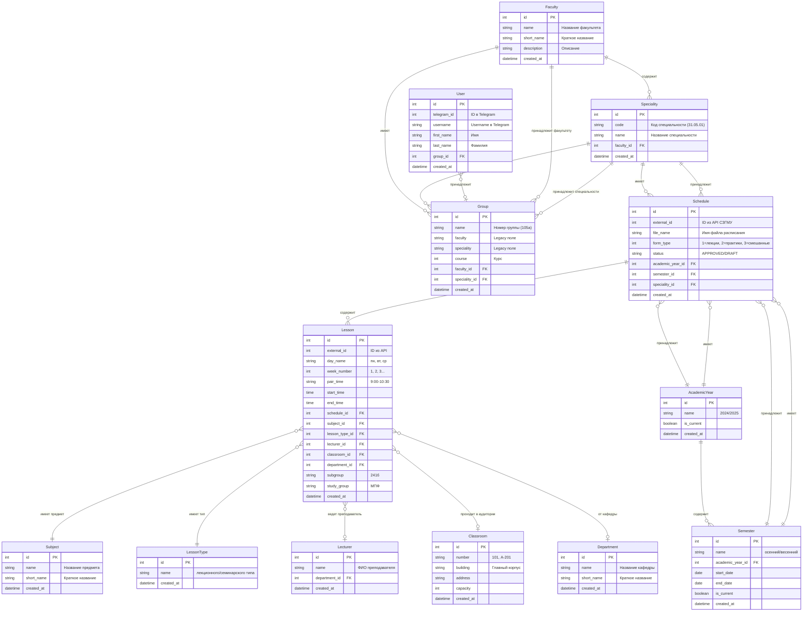

# Схема базы данных SZGMU Bot

## UML Диаграмма создания групп по расписаниям



## Процесс создания групп по расписаниям

### 1. Синхронизация с API СЗГМУ
```
API СЗГМУ → Schedule (расписания) → Lesson (занятия)
```

### 2. Извлечение информации о группах
Из каждого `Lesson` извлекается:
- `study_group` → номер группы (например, "105а")
- `subgroup` → подгруппа (например, "241б")
- Связь с `Speciality` через `Schedule`

### 3. Создание групп
```python
# Псевдокод создания группы
for lesson in lessons:
    group_name = lesson.study_group  # "105а"
    speciality = lesson.schedule.speciality  # Специальность
    
    # Найти или создать группу
    group = find_or_create_group(
        name=group_name,
        speciality=speciality,
        faculty=speciality.faculty,
        course=extract_course_from_group_name(group_name)
    )
```

### 4. Связывание пользователей с группами
```python
# Пользователь выбирает группу
user.group_id = selected_group.id
```

## Ключевые особенности архитектуры

1. **Нормализация данных**: Справочники вынесены в отдельные таблицы
2. **Legacy поля**: В `Group` есть поля `faculty` и `speciality` для совместимости
3. **Внешние ID**: Все записи имеют `external_id` для синхронизации с API
4. **Гибкость**: Один `Schedule` может содержать занятия для разных групп
5. **Связность**: Четкие связи между всеми сущностями

## Проблемы текущей реализации

1. **Дублирование**: `Group.faculty` и `Group.speciality` дублируют данные из связанных таблиц
2. **Неполная нормализация**: Некоторые поля могут быть вынесены в справочники
3. **Отсутствие индексов**: Нужны индексы для быстрого поиска по группам
